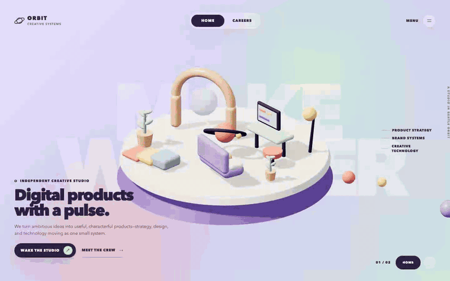

# Three.js Creative Studio

An open-source Agent Skill for designing and shipping intentional, production-minded Three.js
experiences from prompts as small as “make this page feel playful and alive.”

The skill combines art direction, interaction design, framework integration, shaders, assets,
performance, accessibility, lifecycle safety, visual QA, and deployment checks. It is designed to
help an agent make good creative decisions—not merely produce a canvas that technically renders.

## Built with this skill

[](media/orbit-interactions.webm)

**Orbit Studio** is an original Vue + Three.js experience designed, implemented, and verified with
this skill. The recording shows pointer-driven camera parallax, named 3D hover targets, idle motion,
route choreography, scene pulses, responsive UI, and an accessible HTML role panel. Select the
preview above for the full-resolution WebM recording, or inspect the
[benchmark source](evals/orbit-studio/) and [browser tests](evals/orbit-studio/tests/orbit.spec.ts).

## What it can build

- art-directed landing pages, portfolios, product stories, and interactive editorials;
- configurators, data scenes, procedural worlds, deterministic games, particles, and physics;
- game cameras, keyboard/touch/gamepad intent, combat, enemies, levels, pooled VFX, saves, and
  repeatable play tests;
- WebGLRenderer, GLSL, EffectComposer, WebGPURenderer, TSL, and node post-processing routes;
- Blender/glTF pipelines, compressed assets, PBR materials, environments, and responsive lighting;
- accessible HTML/WebGL experiences with keyboard, touch, reduced-motion, and fallback behavior;
- measurable production builds with lifecycle cleanup, performance budgets, capture, and audit tools.

## Framework support

| Host | Recommended integration |
| --- | --- |
| Vanilla JavaScript / TypeScript | Imperative `Experience` controller |
| React | React Three Fiber or an imperative controller behind a canvas ref |
| Next.js | Small client boundary; R3F or an imperative controller |
| Vue | Imperative controller with `onMounted` / `onBeforeUnmount` |
| Nuxt | Vue adapter inside a client-only boundary |
| Svelte / SvelteKit | Imperative controller in `onMount`, with returned cleanup |
| Angular | Controller in `AfterViewInit`, loop outside Angular's zone |
| Astro | Plain or framework island with deliberate hydration |
| Web Components / other hosts | Controller owned by the host's mount and cleanup lifecycle |

Three.js remains a portable renderer subsystem unless a framework-native renderer such as React
Three Fiber provides a clear benefit. Essential content, routes, forms, and navigation stay in
semantic HTML.

## Install

The directory containing `SKILL.md` must be named `threejs` so hosts expose the stable name as
`$threejs`, `/threejs`, or `@threejs` according to their own invocation syntax.

### One global install for compatible agents

Codex and Gemini CLI discover the shared Agent Skills directory. This is the simplest global setup:

```bash
mkdir -p ~/.agents/skills
git clone https://github.com/cp-ugorji/threejs-creative-studio-skill.git ~/.agents/skills/threejs
```

Claude Code uses its own personal skill directory. Reuse the same checkout with a symlink:

```bash
mkdir -p ~/.claude/skills
ln -s ~/.agents/skills/threejs ~/.claude/skills/threejs
```

GitHub Copilot also supports the shared `~/.agents/skills` location for personal skills, so the
first checkout can serve Codex, Gemini CLI, and Copilot together.

### Project-local install

Install the skill in a repository when the team should pin and version it with that project:

```bash
git clone https://github.com/cp-ugorji/threejs-creative-studio-skill.git .agents/skills/threejs
```

You can use a Git submodule instead if the host repository tracks skill updates deliberately:

```bash
git submodule add https://github.com/cp-ugorji/threejs-creative-studio-skill.git .agents/skills/threejs
```

### Agent-specific locations

| Agent | Project scope | Global / personal scope |
| --- | --- | --- |
| [OpenAI Codex](https://developers.openai.com/codex/skills/) | `.agents/skills/threejs` | `~/.agents/skills/threejs` |
| [Claude Code](https://platform.claude.com/docs/en/agents-and-tools/agent-skills/overview) | `.claude/skills/threejs` | `~/.claude/skills/threejs` |
| [Gemini CLI](https://geminicli.com/docs/cli/using-agent-skills/) | `.agents/skills/threejs` or `.gemini/skills/threejs` | `~/.agents/skills/threejs` or `~/.gemini/skills/threejs` |
| [GitHub Copilot](https://docs.github.com/en/copilot/how-tos/copilot-on-github/customize-copilot/customize-cloud-agent/add-skills) | `.agents/skills/threejs`, `.github/skills/threejs`, or `.claude/skills/threejs` | `~/.agents/skills/threejs` or `~/.copilot/skills/threejs` |

After publishing, Gemini CLI can also install directly from the Git remote:

```bash
gemini skills install https://github.com/cp-ugorji/threejs-creative-studio-skill.git
```

GitHub Copilot CLI users can use `gh skill install` on supported CLI versions; the directory method
above remains portable and easy to audit.

### Update or remove

Update a cloned installation:

```bash
git -C ~/.agents/skills/threejs pull --ff-only
```

To remove it, delete only the exact `threejs` skill directory (and the Claude symlink if created).

## Use

The skill can activate automatically when a prompt clearly asks for Three.js work. Explicit
invocation is useful when you want to choose one of its collaboration modes.

### Invoke it in your agent

| Agent | Explicit prompt |
| --- | --- |
| ChatGPT desktop / Work | `@threejs Build a tactile 3D product page.` |
| OpenAI Codex CLI / IDE | `$threejs Build a tactile 3D product page.` |
| Claude Code | `/threejs Build a tactile 3D product page.` |
| GitHub Copilot CLI | `Use the /threejs skill to build a tactile 3D product page.` |
| Gemini CLI | `Use the threejs skill to build a tactile 3D product page.` |

Gemini chooses a matching skill from the prompt and asks before activation; use `/skills list` to
confirm it is installed. In Codex, type `$` or use `/skills`; in ChatGPT, type `@`; Claude Code and
Copilot expose installed skills with slash-style invocation.

### Choose a workflow mode

Place a mode immediately after the skill name. These are prompt conventions handled by this skill,
so they work even when an agent does not support custom slash commands.

| Mode | What the agent does |
| --- | --- |
| `/build` | Default. Makes sensible assumptions, builds, visually inspects, tests, and reports evidence. |
| `/grill-me` | Interviews you in focused rounds, recommends choices, writes the complete brief, then waits for approval before coding. `/drill-me` is an alias. |
| `/brief` | Produces art direction, technical route, asset needs, risks, and acceptance criteria without coding. |
| `/inspire` | Proposes three distinct visual concepts, explains tradeoffs, and recommends one. |
| `/audit` | Reviews an existing experience and returns evidence-ranked findings without changing files. |
| `/diagnose` | Reproduces a bug or slowdown and explains its root cause without silently implementing a fix. |
| `/optimize` | Measures a representative scene, fixes the real bottleneck, and reports before/after evidence. |
| `/game` | Builds a complete playable vertical slice with controls, camera, rules, feedback, reset, mobile behavior, and deterministic tests. |

Use the portable natural-language form if your agent does not expose the skill directly:

```text
Use the threejs skill in grill-me mode. Interview me before designing an immersive portfolio.
```

### Start with a simple prompt

The default `/build` mode is intentionally useful with very little direction:

```text
$threejs Make a premium interactive landing page for a sustainable coffee brand.
```

The agent expands that into an experience brief, selects an appropriate renderer/framework route,
builds the composition in quality-gated passes, captures desktop and mobile evidence, and verifies
accessibility, cleanup, and production output.

### Ask for the detailed interview

```text
$threejs /grill-me I want a memorable 3D portfolio, but I do not know what visual direction,
camera, interactions, or technology it should use.
```

The agent asks only consequential questions in small rounds, offers a recommended answer where
helpful, keeps a decision summary, and presents the final experience contract before making files.
Say “use your judgment and build it” at any time to switch to `/build`.

### More example prompts

Create from a reference while preserving originality:

```text
$threejs /build Study the attached reference for composition, camera, light, and motion—not its
branding or assets. Build an original launch page in the existing Next.js app and verify mobile.
```

Explore directions before choosing one:

```text
$threejs /inspire Give me three radically different concepts for presenting this electric bicycle
in 3D. Keep checkout and product specifications in accessible HTML.
```

Add Three.js safely to an existing framework:

```text
$threejs /build Add an accessible procedural background to this Vue page. Preserve the current
stack, keep the checkout flow fast, and expose only low-frequency scene events to Vue.
```

Audit or diagnose existing work:

```text
$threejs /audit Review this configurator's composition, mobile framing, accessibility, loading,
GPU cleanup, and production behavior. Do not edit anything.

$threejs /diagnose Reproduce the frame drops in this R3F scene and identify whether the bottleneck
is React work, draw submission, shaders, pixels, textures, or physics.
```

Build a game slice:

```text
$threejs /game Build a small isometric delivery game with keyboard and touch controls, a smooth
camera, one complete mission, pooled feedback effects, pause/reset, and deterministic tests.
```

The trigger description also covers natural requests mentioning Three.js, R3F, WebGPU, TSL, GLSL,
glTF, shaders, procedural scenes, interactive 3D, physics, or browser-based 3D games.

## Scaffold a new project

Workflow modes above are instructions to the agent. The commands below are real shell utilities
bundled with the repository. The scaffolder creates an intentionally small, lifecycle-safe baseline:

```bash
node scripts/scaffold.mjs --stack vanilla --out ./my-experience
node scripts/scaffold.mjs --stack r3f --out ./my-experience
node scripts/scaffold.mjs --stack vue --out ./my-experience
node scripts/scaffold.mjs --stack game --out ./my-game
node scripts/scaffold.mjs --stack vue --out ./my-experience --name "My Experience"
```

It refuses to overwrite a non-empty directory. The generated app includes responsive sizing,
capped DPR, accessible controls, reduced-motion handling, deterministic scene ownership, and GPU
cleanup. The `game` starter additionally includes a fixed-step simulation, input-intent boundary,
smoothed isometric camera, keyboard and touch controls, pooled feedback, explicit game states, and
determinism tests.

## Repository map

```text
SKILL.md                    Agent workflow and quality gates
agents/openai.yaml          Skill catalog metadata
references/                 Deep guidance loaded only when relevant
assets/starter-*            Vanilla, R3F, Vue, and deterministic game starters
scripts/scaffold.mjs        Safe starter generator
scripts/audit-threejs.mjs   Bounded static production audit
scripts/capture-threejs.mjs Browser screenshot and console-error capture
docs/media/                  README demo recording and animated preview
evals/challenge-gallery/    Broad 24-scene creative/technical benchmark
evals/orbit-studio/         Framework-portability and visual-design benchmark
```

## Verify the skill

Audit a target project:

```bash
node scripts/audit-threejs.mjs /absolute/path/to/project --strict
```

Run the broad R3F benchmark:

```bash
pnpm --dir evals/challenge-gallery install
pnpm --dir evals/challenge-gallery build
pnpm --dir evals/challenge-gallery test
```

Run the Vue + imperative Three.js design benchmark:

```bash
pnpm --dir evals/orbit-studio install
pnpm --dir evals/orbit-studio build
pnpm --dir evals/orbit-studio test
```

Both benchmarks use original procedural geometry and local code so visual QA does not depend on
third-party model availability.

Build and test the deterministic game starter:

```bash
node scripts/scaffold.mjs --stack game --out /tmp/threejs-game --name "Game Check"
pnpm --dir /tmp/threejs-game install
pnpm --dir /tmp/threejs-game test
pnpm --dir /tmp/threejs-game build
```

## Contributing

Keep the public skill concise at the top level and put detailed domain guidance in `references/`.
New patterns should include current primary documentation, clear ownership and cleanup, a reduced-
motion path, mobile composition, and a production-build check. Add a focused evaluation when a
change introduces a new renderer, framework adapter, or difficult visual technique.

## License

[MIT](LICENSE).
